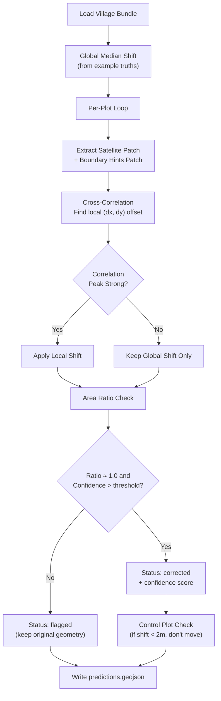

# BhuMe Boundary Correction — Implementation Plan

## Goal

Build a **generalizable, automated pipeline** that corrects shifted cadastral plot boundaries by aligning them to satellite imagery, assigns **meaningful per-plot confidence scores**, and **flags plots that can't be reliably corrected**. Target: Gold/Platinum tier (trustworthy confidence + works across villages).

## Current State

- **Starter kit** at `d:\Bhume\bhume-starter-kit\` — complete with helpers, scoring, baseline
- **Vadnerbhairav data** at `d:\Bhume\Vadnerbhairav\` — has `input.geojson`, `imagery.tif`, `boundaries.tif` (no `example_truths.geojson` yet)
- **Malatavadi data** at `d:\Bhume\Malatavadi\` — has files with browser-renamed suffixes (`input (2).geojson`, `imagery (1).tif`, `boundaries (1).tif`)
- No `example_truths.geojson` for either village yet — **must download from the website**

## User Review Required

> [!IMPORTANT]
> **Data files need renaming & example truths are missing.** The Malatavadi files have "(1)"/"(2)" suffixes from browser downloads. We need to:
> 1. Rename them to match what the starter kit expects (`input.geojson`, `imagery.tif`, `boundaries.tif`)
> 2. Move both village folders into `bhume-starter-kit/data/` with proper slug names
> 3. Download `example_truths.geojson` for both villages from [hiring.bhume.in/start](https://hiring.bhume.in/start)

> [!IMPORTANT]
> **Village slug names needed.** The starter kit expects folders like `data/34855_vadnerbhairav_chandavad_nashik/`. Please confirm:
> - Is the Vadnerbhairav slug: `34855_vadnerbhairav_chandavad_nashik`?
> - What is the Malatavadi slug? (e.g., something like `XXXXX_malatavadi_XXXXX_kolhapur`)

> [!WARNING]
> **Scope decision.** Do you want to attempt **both villages** or focus on one first? Vadnerbhairav (large open farms, easier drift) is recommended to start. The plan below covers both, but we can prioritize.

## Open Questions

1. **Do you have `example_truths.geojson` downloaded for either village?** The baseline scoring and shift estimation depend on these files. If not, you'll need to grab them from the "Get started" page.
2. **Time budget?** The assignment suggests 8–12 hours. How much time do you want to invest in implementation vs. video/write-up?
3. **Do you want a GitHub repo initialized?** I can set up the repo structure with proper `.gitignore`, README, etc.

---

## Proposed Changes

### Phase 0: Data Setup & Verification

#### [NEW] `setup_data.py`
Script to:
- Copy/rename village data into `bhume-starter-kit/data/<village_slug>/` with correct filenames
- Verify all required files exist
- Run `quickstart.py` to confirm the baseline works

Manual steps:
- Download `example_truths.geojson` for both villages from the website
- Place them in the respective data folders

---

### Phase 1: Exploration & Understanding (build intuition)

#### [NEW] `explore.py`
An exploration script that:
- Loads each village and prints statistics (plot count, area distribution, recorded vs. map area ratios)
- Visualizes a grid of plot patches (satellite imagery under plots) to build visual intuition
- Computes the area ratio (`map_area_sqm / recorded_area_sqm`) distribution to identify placement vs. area problems
- Saves diagnostic images showing official outlines overlaid on satellite imagery
- Examines the `boundaries.tif` hint layer and its correlation with real field edges

---

### Phase 2: Core Correction Pipeline

#### [NEW] `solve.py` — The main solution script

The pipeline processes all plots through these stages:

**Stage 1: Global Median Shift (baseline floor)**
- Compute the median (dx, dy) translation from example truths, exactly as the baseline does
- Apply to all plots as the starting point

**Stage 2: Per-Plot Cross-Correlation Refinement**
- For each plot, extract the satellite image patch around the globally-shifted position (with generous padding ~50-100m)
- Extract the boundary hints patch from `boundaries.tif` for the same region
- Create a binary edge mask from the plot's polygon outline
- Use **normalized cross-correlation** (NCC) or **phase correlation** between the plot's edge mask and the detected edges in the imagery/boundary hints to find the optimal local (dx, dy) offset
- This recovers per-plot drift that differs from the global shift (local stretching, rotation residuals)

**Stage 3: Edge-Based Snapping (optional refinement)**
- For plots where cross-correlation gives a strong peak, additionally try to snap individual vertices to nearby detected edges using the Canny edge detection on the satellite imagery
- This helps with rotation/shape adjustments beyond pure translation

**Stage 4: Area-Ratio Analysis & Flagging**
- Compute `area_ratio = map_area_sqm / total_recorded_area` where `total_recorded_area = recorded_area + pot_kharaba`
- Plots with `area_ratio` far from 1.0 (e.g., < 0.5 or > 2.0) are candidates for flagging — the drawn shape disagrees with the record, and no translation will fix that
- Plots where `recorded_area` is null/missing are also flag candidates (no evidence to validate against)
- Plots where the cross-correlation peak is weak (low correlation score) should be flagged

**Stage 5: Confidence Scoring**
The confidence score combines multiple signals into a meaningful 0–1 value:

| Signal | Weight | Rationale |
|--------|--------|-----------|
| Cross-correlation peak strength | High | Strong peak = clear match in imagery |
| Area ratio closeness to 1.0 | Medium | Shape agrees with records = more trustworthy |
| Boundary hint density under plot | Low-Med | Dense hints = more visible field edges |
| Plot size (area) | Low | Larger plots are easier to place |
| Edge clarity in satellite imagery | Low-Med | Clear bunds/edges = confident placement |

The raw combined score is **calibrated** using isotonic regression or simple binning on the example truths to ensure high-confidence predictions really are accurate. (With only 6–9 example truths this is rough, so the formula should be principled enough to generalize.)

**Stage 6: Control Plot Detection (Restraint)**
- Before applying any correction, check if the plot is already well-placed by computing IoU between the original position and the "corrected" position
- If the shift is < 2-3 metres, leave the original geometry (mark as corrected with high confidence, but don't actually move it)
- This prevents false shifts of already-correct plots

---

### Phase 3: Output & Scoring

#### [MODIFY] Output handling
- Use `write_predictions()` to save `predictions.geojson` per village
- Run `score()` against example truths for self-evaluation
- Save diagnostic visualizations (before/after overlays for sample plots)

#### [NEW] `evaluate.py`
A diagnostic script that:
- Runs scoring and prints detailed results
- Generates before/after comparison images for example truth plots
- Plots confidence vs. IoU scatter to visually check calibration
- Outputs a summary table of flagged vs. corrected counts

---

### Phase 4: Submission Packaging

#### [NEW] Repository structure
```
bhume-takehome/
├── bhume/                    # starter kit helpers (unchanged)
├── data/
│   ├── <vadnerbhairav_slug>/
│   │   ├── input.geojson
│   │   ├── imagery.tif
│   │   ├── boundaries.tif
│   │   ├── example_truths.geojson
│   │   └── predictions.geojson    ← our output
│   └── <malatavadi_slug>/
│       ├── input.geojson
│       ├── imagery.tif
│       ├── boundaries.tif
│       ├── example_truths.geojson
│       └── predictions.geojson    ← our output
├── transcripts/
│   └── README.md                  # AI chat links
├── solve.py                       # main pipeline
├── explore.py                     # data exploration
├── evaluate.py                    # scoring & diagnostics
├── quickstart.py                  # original starter kit
├── pyproject.toml
├── uv.lock
└── README.md
```

---

## Architecture Overview



---

## Key Technical Decisions

### Why Cross-Correlation over ML?
- **Interpretable**: We can explain exactly what happened to each plot
- **No training data needed**: Works with the imagery directly
- **Generalizable**: Same algorithm works across villages (no tuning to example truths)
- The boundary hints file already contains ML-detected edges — we leverage that signal without training anything

### Why Not Just Global Shift?
- The global shift treats every plot identically, which misses:
  - **Local geometric distortion** (the old paper map stretched unevenly)
  - **Rotation** (some plots rotated slightly during georeferencing)
  - **Outliers** (some plots drifted more than the median)
- Cross-correlation recovers these per-plot differences

### Confidence Strategy
- Confidence must be **earned**, not flat. The key insight: a strong cross-correlation peak + agreeable area ratio = high confidence. A weak peak or area mismatch = low confidence or flag.
- We avoid overfitting to the ~6-9 example truths by making the formula principled (based on signal quality, not tuned coefficients).

---

## Verification Plan

### Automated Tests
```bash
# 1. Run baseline to verify setup
uv run quickstart.py data/<vadnerbhairav_slug>

# 2. Run our solution
uv run solve.py data/<vadnerbhairav_slug>

# 3. Score against example truths
uv run evaluate.py data/<vadnerbhairav_slug>

# 4. Repeat for Malatavadi
uv run solve.py data/<malatavadi_slug>
uv run evaluate.py data/<malatavadi_slug>
```

### Key Metrics to Track
| Metric | Baseline | Our Target |
|--------|----------|------------|
| Median IoU (pred) | ~0.71 | > 0.75 |
| Median IoU improvement | +0.11 | > +0.15 |
| Spearman (conf, IoU) | — (flat) | > 0.3 |
| AUC | — (flat) | > 0.6 |
| False shift rate | unknown | 0.0 |

### Manual Verification
- Visual inspection of before/after overlays on satellite imagery for ~10 plots
- Upload `predictions.geojson` to the website's Test page to validate format
- Check that flagged plots are genuinely ambiguous (area mismatch, no visible edges, etc.)
